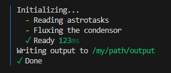
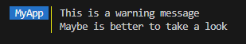
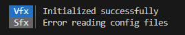

**inkdent**

---

# 🪶 Inkdent

Simple logging library with scoped indentation and semantical formatting.

```
npm install inkdent
```

[[API documentation](_media/globals.md)]

## Quick Start

```ts
// 1. Import the package
import { Inkdent } from 'inkdent';

// 2. Create a instance
const ink = new Inkdent();

// 3. Build the string to log
ink
  .string('Initializing...')
  .push()
  .task('Reading astrotasks')
  .task('Fluxing the condensor')
  .pop()
  .string('Writing output to ')
  .path('/my/path/output ')
  .duration(123)
  .nl()
  .task('Done', true)
  // then output it
  .log();
```

This simple code will generate the following output:



---

Different log levels (`log`/`info`/`warn`/`error`) will output different colors.

```ts
ink
  .string('This is a warning message')
  .nl()
  .string('Maybe is better to take a look')
  .warn();
```



---

Play with other options, like setting up namespaces

```ts
const vfx = new Inkdent({ ns: 'Vfx' });
const sfx = new Inkdent().ns('Sfx', chalk.bgGray);

vfx.string('Initialized successfully').info();
sfx.string('Error reading config files').error();
```



Or [dive into the documentation](_media/globals.md) for more available methods and options.
